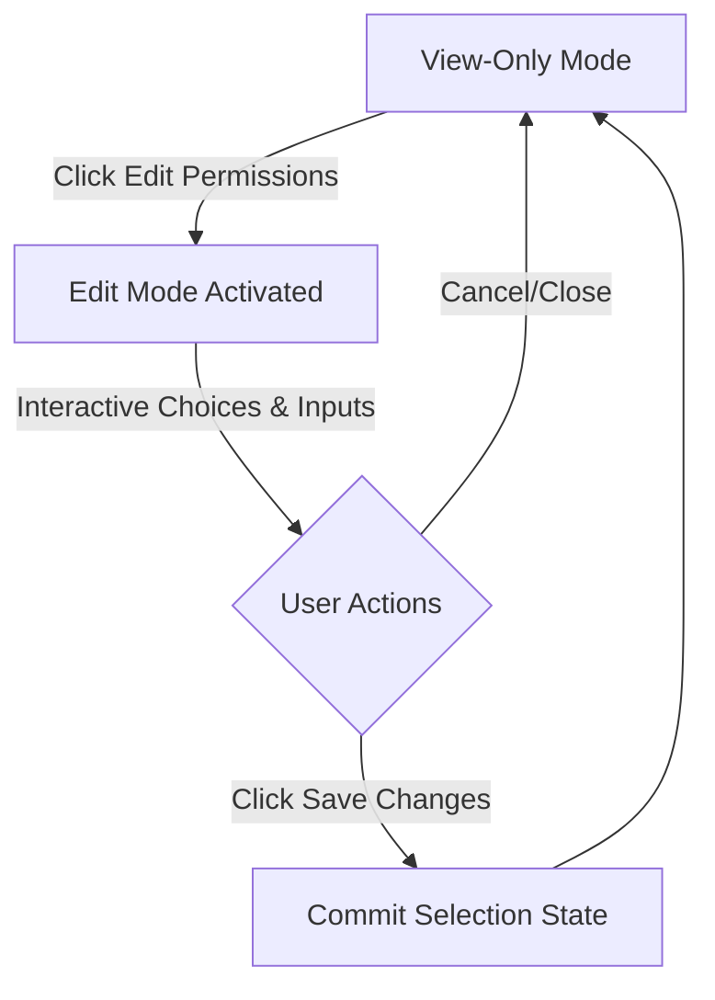

# Creator Thoughts
Just to write the ouput of ubuntu manually and do the needed . tooo lazy to install it.
readme for guide if you cant understand, just press some buttons in the ui you will figure out all the best!  

---

# Ubuntu 24.04 Environment Simulation

A high-fidelity, interactive Ubuntu 24.04 Environment Simulation built entirely within a single static footprint. The project integrates a dynamic Command Line Terminal emulator with a native-styled GNOME Nautilus Custom Permissions Panel, enabling seamless interaction and live configuration state toggles.

---

## 1. Project Overview

This simulation brings the signature Ubuntu 24.04 desktop look-and-feel to the web. Operating within a single-file structure, it connects two highly polished desktop components:

*   **Dynamic Command Line Terminal**: An interactive terminal window featuring custom hotkeys, identity parsing, contenteditable command input, and dynamic syntax highlighting.
*   **GNOME Custom Permissions Panel**: A pixel-perfect recreation of the native Yaru-styled file properties dialog box, featuring absolute layout adjustments, flat read-only views, and inline input states.

---

## 2. Terminal Simulation Mechanics

The terminal mimics real-world Linux prompt formatting through an advanced client-side parsing engine. 

### Clipboard / Paste Parsing Engine
When multi-line text is pasted, the simulation intercepts the raw standard event, strips out any incoming rich-text formatting, and runs the plaintext strings through a dedicated line-parsing engine.

If a bash prompt signature is identified (using regex bounds for `user@hostname:path$`), it decomposes the prompt into styled HTML elements conforming to standard Ubuntu console theme specifications:

| Element | RegEx Match Group | Render Color | CSS Hex Code | Style Description |
| :--- | :--- | :--- | :--- | :--- |
| **Username & Hostname** | `([a-zA-Z0-9._-]+@[a-zA-Z0-9._-]+)` | Bright Green | `#33d17a` | Vibrant, bold terminal user identifier |
| **Separator Colon** | `(:)` | Pure White | `#ffffff` | Bold system path separator |
| **Directory Path** | `([^$#]*)` | Crisp Yaru Blue | `#3584e4` | System folder nodes |
| **Prompt Symbol** | `([$#])` | Pure White | `#ffffff` | Standard user prompt char |
| **Command & Arguments** | `([\s\S]*)` | Crisp White | `#ffffff` | Flat text command strings |

### Dynamic File Listing ('ls') Coloring
To enforce strict visual fidelity with real Linux directory listing outputs:
*   **Standard Files**: Normal data and source code extensions (`.js`, `.jsx`, `.ts`, `.tsx`, `.json`, `.css`, `.txt`) are colored in clean **uniform white (`#ffffff`)**.
*   **Executable Scripts**: **Only** explicit shell scripts or executables (`.sh` extensions) are formatted in **bright green (`#33d17a`)**. 

---

## 3. Custom Permissions Panel Architecture

The file permissions panel recreates the standard Nautilus dialog box structure, implementing a complete View vs. Edit state toggle machine.



### Native Yaru Design Specifications
*   **Aspect Ratio Constraints**: The window container width is locked to a precise **`440px`** profiles (`max-width: 440px`) to replicate standard system properties cards and prevent scaling distortion on wide screens.
*   **Card Framework**: Items are organized in elegant Yaru-style card components with solid rounded corners (`14px`), subtle border details, and fainted line breaks between rows.

### View-Only Mode vs. Edit Mode Toggles
The interface leverages a single-state global action controller located outside the main card boundary:

1.  **View-Only Mode (Default)**:
    *   **Flat text presentation**: Username values ("Owner", "Group") sit cleanly **right-aligned** to their card borders. No interactive dropdown boxes or selection chevrons are rendered, mimicking a pristine directory properties card.
    *   **Muted select fields**: Chevron elements for actual access control rows (Owner, Group, and Others) are rendered in a low-opacity disabled style (`opacity: 0.4`), signaling read-only visibility.
2.  **Edit Mode (Active)**:
    *   Clicking the **"Edit Permissions"** dark gray action button toggles a `.edit-mode` class on the container wrapper, changing the button text to **"Save Changes"** and highlighting it in GNOME green (`#2ec27e`).
    *   Unlocks borderless selection widgets (`pointer-events: auto`) and unhides dropdown indicator chevrons.
    *   Displays inline edit options (`.inline-edit-btn`), enabling dynamic username and group state changes.
    *   Clicking **"Save Changes"** commits the modifications to the local JS models and locks the fields back into the flat View-Only presentation.

---

## 4. Technical Implementation & Deployment

### Footprint & Core Stack
The environment simulation is engineered with a minimalist footprint, making it lightweight and fast:

*   **Markup**: Pure Semantic HTML5.
*   **Styling**: Vanilla CSS utilizing custom `:root` Yaru CSS variables for uniform colors and transition states.
*   **Behavior**: Vanilla JavaScript (ES6+) DOM API state machine, requiring **zero** compilation, packages, or backend structures.

### Local Installation
Since the project runs as a single flat file, no complex setups are required:

1. Clone this repository locally:
   ```bash
   git clone https://github.com/Soura149/ubuntuTerminalui.git
   ```
2. Navigate to the project directory:
   ```bash
   cd ubuntuTerminalui
   ```
3. Open `index.html` in any web browser:
   * **Windows**: Double-click `index.html` or run `start index.html` in PowerShell.
   * **Mac**: Run `open index.html` in the terminal.
   * **Linux**: Run `xdg-open index.html` or launch it via your local file explorer.
